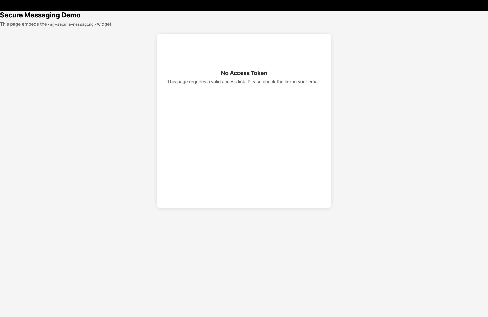
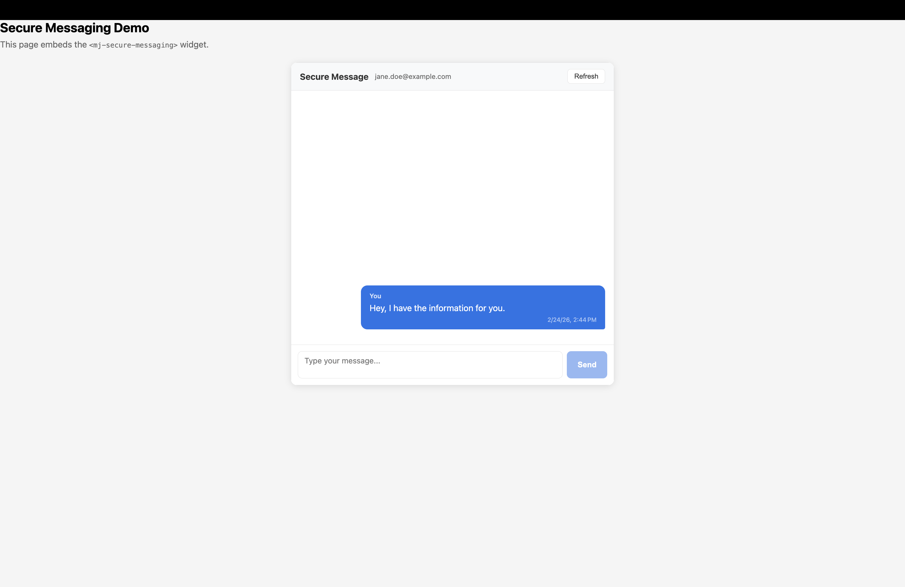
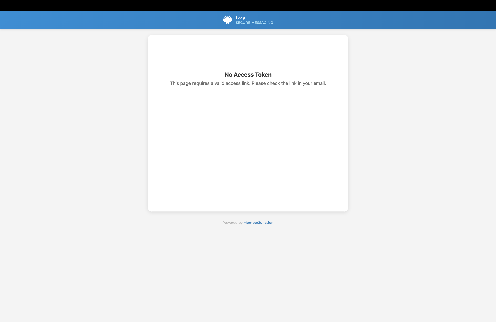
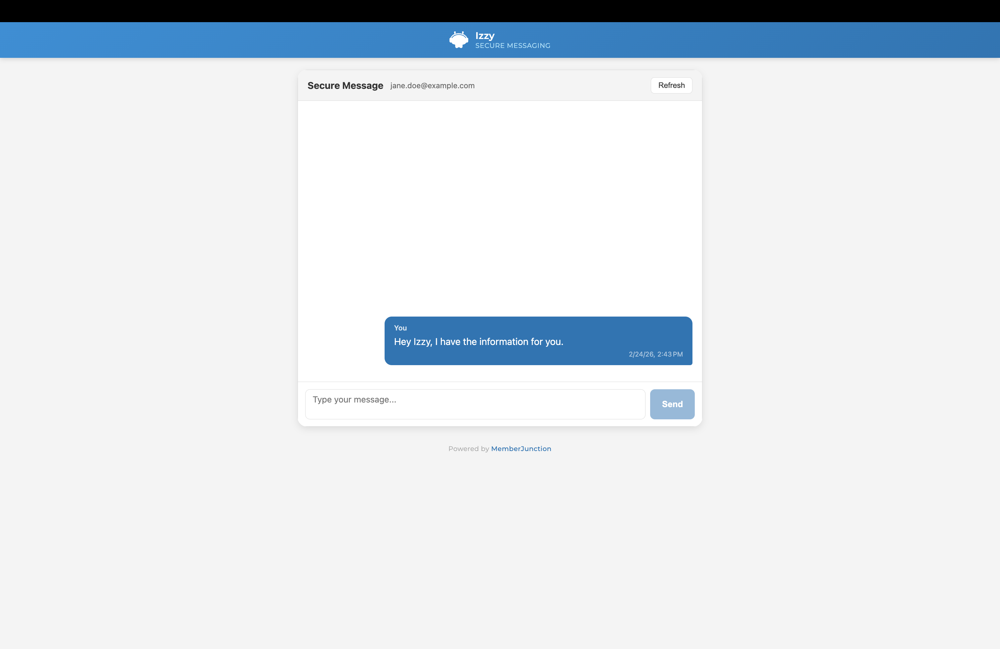

# MJ Secure Messaging

A free MemberJunction Open App that adds a **Secure Web** channel type for encrypted, token-based conversations with external contacts through an embeddable widget.

## The Problem

When an MJ-powered AI agent handles customer interactions via email or SMS, sensitive conversations — renewals, document collection, PII exchange — present a security risk. Email content lives on external mail servers, SMS is inherently insecure, and neither provides a controlled audit trail. Organizations need a way to redirect sensitive conversations to a secure, auditable channel where data stays in their own database.

## How It Works

When the AI agent encounters a sensitive conversation, it redirects the external contact from email/SMS to a secure web portal. The contact clicks a link, lands on the organization's website, and continues the conversation securely — with full AI processing, approval workflows, and audit logging.

```
AI agent detects sensitive conversation
  → Server creates PortalSession + generates token
  → Contact receives secure link via email/SMS
  → Contact clicks link → widget validates token
  → Conversation continues securely in the browser
  → Messages flow through MJ's standard AI pipeline
```

**Key benefits over email:**
- Sensitive content stays in your database, not scattered across email servers
- Session tokens expire and can be revoked
- No passwords — token-based and magic link authentication
- Messages flow through MJ's standard ChannelMessage pipeline (AI, approvals, audit)

## Screenshots

### Default Widget (Generic Branding)

The widget ships with a clean default look that works out of the box:

| No Token | Authenticated |
|----------|---------------|
|  |  |

### Custom Branding (Izzy Example)

The widget is fully themeable via CSS custom properties and the `brand-color` attribute. Here's the same widget restyled to match Izzy's brand identity — custom header, colors, fonts, and logo:

| No Token | Authenticated |
|----------|---------------|
|  |  |

## Installation

```bash
mj app install https://github.com/MJ-Central/app-secure-messaging
```

This will:
1. Create the `secure_messaging` database schema
2. Run migrations (PortalSession, PortalMagicLink tables)
3. Register the "Secure Web" channel type and communication provider
4. Install server and client bootstrap packages

## Quick Start

### 1. Create a Secure Web Channel

After installation, create a new channel with the "Secure Web" channel type for your organization.

### 2. Embed the Widget

Build the Angular Element and add it to any page on your website:

```html
<script src="mj-secure-messaging.js"></script>
<mj-secure-messaging
  api-base-url="https://yoursite.com/secure-messaging/api/v1"
  brand-color="#1a73e8"
></mj-secure-messaging>
```

### 3. Generate Session Links

When your AI agent needs to redirect a conversation to a secure channel, it creates a PortalSession and sends the contact a link:

```
https://yoursite.com/secure?token=sm_abc123...
```

The contact clicks the link, the widget validates the token, and the conversation continues securely.

## Theming

The widget exposes 10 CSS custom properties for full visual control:

```css
mj-secure-messaging {
  --sm-brand-color: #0076B6;      /* Header, buttons, outbound bubbles */
  --sm-text-color: #333;          /* Primary text */
  --sm-text-secondary: #666;      /* Secondary/meta text */
  --sm-bg-color: #fff;            /* Widget background */
  --sm-header-bg: #F4F4F4;        /* Header bar background */
  --sm-border-color: #D9D9D9;     /* Borders and dividers */
  --sm-bubble-inbound-bg: #F4F4F4; /* Inbound message bubble */
  --sm-compose-bg: #fff;          /* Compose area background */
  --sm-input-bg: #fff;            /* Text input background */
  --sm-hover-bg: #eef7fc;         /* Hover states */
}
```

The `brand-color` HTML attribute sets the primary accent color (header, buttons, outbound message bubbles).

## Widget API

### Attributes

| Attribute | Description | Default |
|-----------|-------------|---------|
| `api-base-url` | Base URL for the Secure Messaging API | Inferred from current origin |
| `token` | Session token (or reads from URL `?token=` param) | — |
| `brand-color` | Hex color for header and buttons | `#1a73e8` |

### Events

| Event | Detail | Description |
|-------|--------|-------------|
| `session-ready` | `{ sessionId, contactEmail, threadId }` | Auth succeeded |
| `session-expired` | — | Token invalid or expired |
| `message-sent` | `{ messageId }` | User sent a message |

## REST API

Mounted at `/secure-messaging/api/v1` (configurable).

**Auth (public):**
- `POST /auth/validate` — Validate a session token
- `POST /auth/magic-link` — Request a magic link
- `POST /auth/magic-link/redeem` — Redeem a magic link

**Messages (protected — `Authorization: Bearer sm_*`):**
- `GET /threads/:threadId/messages` — Get thread messages
- `POST /threads/:threadId/messages` — Send a message

**Attachments (protected):**
- `GET /threads/:threadId/attachments` — List attachments
- `POST /threads/:threadId/attachments` — Upload an attachment

## Authentication Model

**No passwords, no OAuth, no user accounts required.**

- **Session tokens** (`sm_*`): 256-bit random, SHA-256 hashed in DB, 7-day sliding TTL
- **Magic links** (`sm_ml_*`): Single-use re-auth, 15-minute TTL, redeemed into a fresh session token
- Raw tokens are never stored — only SHA-256 hashes exist in the database

## Building the Widget

```bash
cd packages/ng-secure-messaging
npm install
npm run build:bundle
```

Output: `dist/mj-secure-messaging.js` — a single JS file you can host anywhere. Works on any website regardless of framework (React, Vue, static HTML, WordPress, etc).

## Architecture

```
mj-secure-messaging/
├── mj-app.json                    # Open App manifest
├── migrations/                    # Skyway SQL migrations
├── metadata/                      # Entity, channel type, provider registrations
├── packages/
│   ├── server/                    # Auth service, REST API, communication provider
│   ├── server-bootstrap/          # Server startup registration
│   ├── ng-secure-messaging/       # Angular Element widget
│   └── ng-bootstrap/              # Client startup registration
└── test/                          # Demo page and API test scripts
```

## Requirements

- MemberJunction >= 5.0.0
- SQL Server (for `secure_messaging` schema)
- Node.js >= 20

## License

MIT
