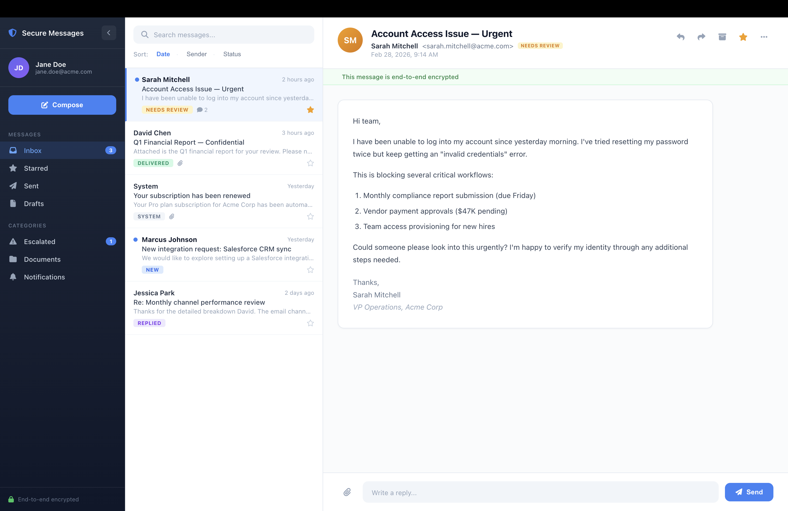

# MJ Secure Messaging

A free MemberJunction Open App: a **secure client portal** for exchanging messages, documents, and
e-signatures with external contacts. Contacts enter through **passwordless magic links** that
deep-link them into subject-lined **conversation threads** — no accounts, no passwords — while staff
work the same threads from an **Executive Inbox** inside MJ Explorer. An embeddable
`<mj-secure-messaging>` widget puts the contact side on any website you own.

## The Problem

Sensitive conversations — renewals, document collection, PII, signatures — routinely happen over
email and SMS, where content lives on external mail servers with no lifecycle and no controlled
audit trail. Client-portal products solve this but bring their own friction: client accounts,
passwords, 2FA resets. This app gives you the portal without the friction: the sensitive content
stays in **your own MemberJunction database**, and the contact's entire experience is one click on
a private link.

## How It Works

```
Staff compose (or an insecure email/SMS thread is promoted)
  → a SecureThread is created for the contact
  → the contact gets a single-use magic link (email nudge)
  → clicking it lands them INSIDE that conversation — read, reply, upload, sign
  → each contact has one portal session across all their threads;
    with multiple threads they also get an inbox to move between them
  → staff read and reply from the Executive Inbox in MJ Explorer
```

**Key properties:**
- The **thread** is a first-class record — subject line, lifecycle (`Active → Closed → Archived`),
  and every message, file, file request, and signature request hangs off it
- **Passwordless**: single-use magic links redeem into sliding, revocable sessions; raw tokens are
  never stored (SHA-256 hashes only)
- **File Requests** with a real lifecycle: staff request documents, contacts fulfill (multiple
  files per request); requests can be cancelled by staff or expire at their due date, and only
  open ones are shown to the contact
- **E-signature** through the core MJ eSignature engine (DocuSign, PandaDoc, Dropbox Sign) with
  visual signature-field placement — sent and tracked per thread
- **Closed threads render read-only** for the contact; archive/trash for staff
- Sensitive content stays in your database, with MJ Record Changes providing the audit trail

## Staff Experience (MJ Explorer)

After installation, **Secure Messages** appears in the MJ Explorer app switcher.

- **Executive Inbox** — a 3-pane inbox over the secure threads: categories
  (Inbox/Starred/Archived/Trash), per-contact workspaces, search/sort, unread badges, starring,
  attachment display, and an inline reply bar.
- **Client Workspace** — a per-contact "client 360": that contact's threads, file requests,
  signatures, documents, session/security controls (revoke, send new link), and audit trail, with
  a basic/advanced progressive-disclosure toggle. Staff can cancel open file requests from here.



### Embedding the Client Workspace in your own app

The workspace is also a general-purpose Angular component any MJ host app can embed:

```typescript
import { SecureMessagingModule } from '@mj-biz-apps/secure-messaging-ng';
// in your module: imports: [ SecureMessagingModule ]
```

```html
<mj-secure-messaging-client-workspace
  [contactId]="person.ID"
  [suppressToasts]="true"
  [persistModePreference]="false"
  (openThreadRequested)="openConversation($event)"
  (actionCompleted)="refreshSomething($event)"
  (modeChanged)="onModeChanged($event)">
</mj-secure-messaging-client-workspace>
```

| Input | Purpose |
|-------|---------|
| `contactId` | The `MJ_BizApps_Common: People.ID` the workspace is scoped to (required) |
| `contactName/Email/Title/Phone` | Optional display overrides (resolved from the Person entity if omitted) |
| `initialMode` | `'basic'` \| `'advanced'` — overrides the persisted preference |
| `suppressToasts` | When `true`, the host owns user feedback (no internal toasts) |
| `persistModePreference` | When `false`, don't read/write the basic/advanced preference (use for multiple embeds on one page) |

| Output | Fires when |
|--------|-----------|
| `openThreadRequested: OpenThreadRequest` | A thread row is clicked — host decides how to open it |
| `actionRequested / actionCompleted: WorkspaceActionRequest` | A request/signature action is started / completed |
| `modeChanged: 'basic' \| 'advanced'` | The user toggles advanced mode |
| `closeRequested` | The workspace asks to be dismissed |

Contract types (`OpenThreadRequest`, `WorkspaceActionRequest`, `ContactSelection`) are exported
from the same package. The component self-loads its data via MJ's `Metadata`/`RunView`, so the
host only needs a live MJ provider — no other wiring.

## Contact Experience (the widget)

External contacts use the embeddable Angular Element — typically hosted on your own site at the
URL your magic links point to (`SECURE_MESSAGING_PORTAL_URL`):

```html
<script src="mj-secure-messaging.js"></script>
<mj-secure-messaging
  api-base-url="https://yoursite.com/secure-messaging/api/v1"
  brand-color="#1a73e8"
></mj-secure-messaging>
```

A contact arriving on a magic link lands directly in the linked conversation. A contact with more
than one thread gets an **inbox** (subject, last activity, status) with an "All conversations"
back affordance; a contact with one thread never sees it. Closed threads are readable but the
compose box is hidden. Messages support staged attachments (committed on send) and fulfillment of
open file requests.

Build the widget bundle:

```bash
cd packages/Element
npm install
npm run build:bundle
```

### Widget Theming

The widget ships with sensible Material-3-style defaults and does not require the MJ runtime or
MJ design tokens. To match your site's accent color, set the `brand-color` attribute or the
`--sm-brand-color` CSS variable:

```css
mj-secure-messaging {
  --sm-brand-color: #0076B6;
}
```

### Widget API

| Attribute | Description | Default |
|-----------|-------------|---------|
| `api-base-url` | Base URL for the Secure Messaging API | Inferred from current origin |
| `token` | Session token (or reads from URL `?token=` / `?ml=` params) | — |
| `brand-color` | Hex color for header and buttons | `#1a73e8` |

| Event | Detail | Description |
|-------|--------|-------------|
| `session-ready` | `{ sessionId, contactEmail, threadId? }` | Auth succeeded (`threadId` present when a magic link deep-linked) |
| `session-expired` | — | Token invalid or expired |
| `message-sent` | `{ messageId }` | Contact sent a message |
| `file-uploaded` | `{ attachmentId, filename }` | Contact uploaded a file |

## Installation

```bash
mj app install https://github.com/MemberJunction/bizapps-secure-messaging
```

This will:
1. Create the `__mj_BizAppsSecureMessaging` database schema and run migrations
2. Run CodeGen to register the entities (SecureThread, SecureMessage, PortalSession, …)
3. Register the **Secure Messages** application, actions, and metadata in MJ Explorer
4. Install the server and client bootstrap packages

See [docs/INSTALL.md](docs/INSTALL.md) for the full provisioning walkthrough (fresh database,
credentials for file storage and e-signature, and the notify hook).

### Configuration (environment)

| Variable | Purpose |
|----------|---------|
| `SECURE_MESSAGING_PORTAL_URL` | Public origin of the contact widget — magic links point here |
| `SECURE_MESSAGING_EMAIL_PROVIDER` / `FROM_EMAIL` / `FROM_NAME` | Outbound nudge emails via MJ's CommunicationEngine (no-ops when unset) |
| `SECURE_MESSAGING_PROMOTE_SECRET` | HMAC signing secret for the server-to-server `/promote` endpoint (disabled when unset) |
| `SECURE_MESSAGING_MESSAGE_BACKEND` | `owned` (default, self-contained) or `channel` (mirror into Izzy's Channel Messages) |

File storage (Box, etc.) and e-signature (DocuSign, etc.) credentials are configured in-app
through MJ's Credential Engine — see [docs/INSTALL.md](docs/INSTALL.md).

## REST API

Mounted at `/secure-messaging/api/v1`. Contact-facing routes authenticate with opaque portal
session tokens (`Authorization: Bearer sm_*`), not MJ user accounts.

**Auth (public):**
- `POST /auth/validate` — validate a session token
- `POST /auth/magic-link` — request a magic link for a session
- `POST /auth/magic-link/redeem` — redeem a magic link (single-use) into a fresh session token

**Promote (server-to-server, HMAC-signed):**
- `POST /promote` — promote an insecure (email/SMS) conversation into a secure thread: creates the
  contact, thread, session, and magic link, and imports the prior message history

**Threads (protected):**
- `GET  /threads` — the authenticated contact's threads (their portal inbox)
- `GET  /threads/:threadId/messages` · `POST /threads/:threadId/messages`
- `GET  /threads/:threadId/attachments` · `POST /threads/:threadId/attachments` ·
  `GET /threads/:threadId/attachments/:id/download`
- `GET  /threads/:threadId/file-requests` · `POST .../file-requests` ·
  `POST .../file-requests/:id/fulfill` (multipart; pass `complete=false` for all but the last of a
  multi-file fulfillment)
- `GET  /threads/:threadId/signature-requests` · `POST .../signature-requests` ·
  `POST .../signature-requests/:id/refresh-status` · `POST .../signature-requests/:id/void` ·
  `GET  .../signature-requests/:id/signed-document`

Every thread-scoped route verifies the authenticated contact owns the thread.

## Authentication Model

**No passwords, no OAuth, no contact accounts.**

- **Sessions are per-contact**: one active session grants portal access to all of that contact's
  threads. 256-bit random tokens (`sm_*`), SHA-256 hashed in the DB, 7-day sliding TTL, revocable
  by staff.
- **Magic links** (`sm_ml_*`): single-use, 15-minute TTL, redeem into a fresh session token, and
  optionally **deep-link to a specific thread**.
- Raw tokens are never stored — only SHA-256 hashes exist in the database.
- Transport is TLS; content is stored in your own database (this is not end-to-end encryption).

## Architecture

```
mj-secure-messaging/
├── mj-app.json                 # Open App manifest
├── migrations/                 # Skyway SQL migrations (SecureThread, SecureMessage, …)
├── metadata/                   # Application, actions, entity overrides (mj-sync)
├── packages/
│   ├── Entities/               # Generated entity subclasses (CodeGen)
│   ├── Actions/                # MJ Actions (generated + custom)
│   ├── Core/                   # PortalAuthService, message/file stores, config
│   ├── Server/                 # REST handlers, resolvers, notify hook, bootstrap
│   ├── Angular/                # Staff UI (inbox, workspace) + shared conversation components
│   └── Element/                # <mj-secure-messaging> widget bundle (Angular Element)
└── docs/                       # PRD, INSTALL, build charter
```

## Requirements

- MemberJunction >= 5.45.0
- SQL Server (for the `__mj_BizAppsSecureMessaging` schema)
- Node.js >= 20

## Roadmap (v2)

- **Outlook "Secure Send" add-in** — promote a compose draft into a secure thread from Outlook
- **Izzy bridge** — AI-driven "switch to secure channel" promotion from email/SMS
- Signed-document auto-return: completed envelopes re-appear in the thread as a message file
- Optional returning-contact registration

## License

MIT
