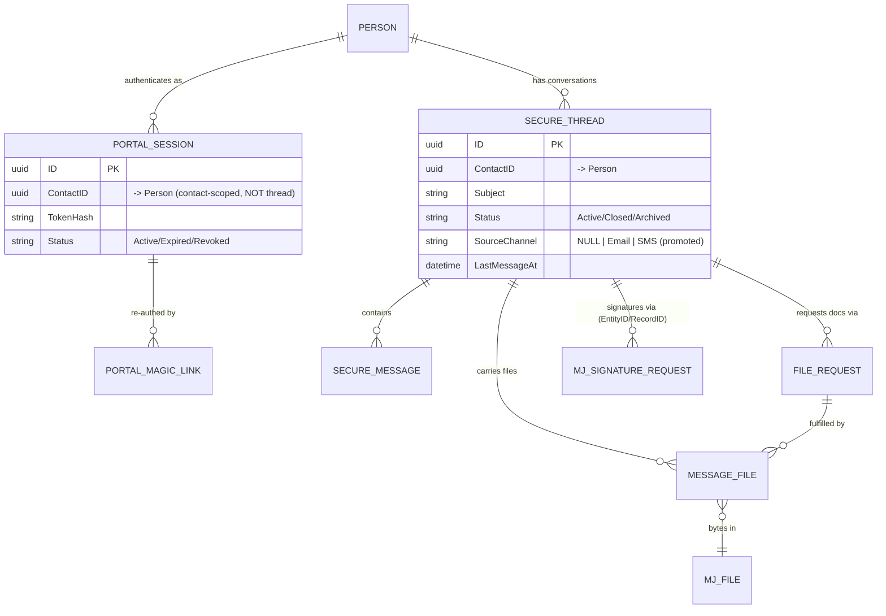

# MJ Secure Messaging — Product Requirements Document (v2)

> **Status:** living document, **v2** — a ground-up re-anchoring written after a full audit of the
> v1 codebase and a deep product teardown of TitanFile (July 2026). v1's PRD conflated two product
> models (single-thread chat window vs. client portal); this version decides the model and lays out
> the path from what's built to the vision. The v1 PRD is preserved in git history.
>
> **Ship status (July 2026):** app **v1.0** ships build-plan phases 1–4 (§11): the SecureThread
> model, request lifecycles, the contact portal inbox, and the staff surfaces — all verified
> end-to-end (messages, files, e-signature). App **v2** targets the bridges (§9: the Outlook
> "Secure Send" add-in — built on the `outlook-secure-send` branch — and the Izzy trigger), plus
> signed-document auto-return, registration (§5), and the later items in §11.

---

## 1. The assignment (vision)

A **free, installable MemberJunction Open App** that gives any organization a **TitanFile-class
secure portal** for exchanging messages, documents, and e-signatures with **external parties**
(clients, members, applicants) — with a modern chat UX, **passwordless magic-link entry**, and
**bridges** that pull conversations out of insecure channels (email/SMS via Izzy, Outlook via a
Secure Send add-in) into the secure channel.

The canonical story:

1. A contact emails something sensitive (tax docs, an SSN change, financial statements).
2. The org — or Izzy — replies: *"let's switch to a secure channel — click here."* (magic link)
3. The contact clicks and lands **directly in the secure conversation** — no password, no account
   setup — where they read, reply, upload, fulfill document requests, and sign.
4. Staff work the same conversations from an Executive Inbox inside MJ Explorer.

Two halves ship together: the **owned backend** (5 entities + REST API, no message bus, no push
infra) and the **embeddable widget** (`<mj-secure-messaging>`, a standalone Angular Element any
site can drop in).

## 2. Market benchmark: TitanFile (researched July 2026)

TitanFile is the reference product (law/accounting firms ↔ clients). Its model, confirmed from
their docs:

- **Channels** — persistent, **subject-lined** secure workspaces, "similar to email threads."
  Staff create them like composing an email (subject → contacts → attach → send). A client can be
  in unlimited channels. Granularity (per-client / per-matter / per-topic) is left to naming
  convention — there is **no client/matter hierarchy**.
- **Client portal** — after login the client lands in a **channel list** (Active / Archived /
  Starred + search) showing only their channels. But in practice clients rarely browse: the
  **notification email deep-links straight into the channel**.
- **Client auth = password + 2FA guest accounts.** No magic links. This is their **#1 support
  burden** (multiple support FAQs + reviews about clients confused at first login). Their only
  frictionless modes sacrifice security or interactivity (Open Access links are view-only).
- **File requests: none.** No checklist/request lifecycle exists — staff just ask in the channel.
  Their inbound story is "Secure Submit" (a public intake form that auto-creates a channel).
- **E-signature** — DocuSign delegation: *Sign* on a channel file → prepare/place fields in
  DocuSign → status tracked in-channel (**Draft → Signing → Signed**) → **signed file
  auto-returns to the channel** with a certificate of completion.
- **Notifications** — per-event email with a deep-link button; per-channel mute; a **"Safe
  Notifications"** mode strips message text/filenames from the email. No digests.
- **Lifecycle** — channels: active → archived (per-user) → expiry/retention → trash → hard delete.
- **Compliance armor** — ISO 27001/SOC 2/HIPAA, court-admissible audit exports, watermarking,
  data-residency choice, customer-managed keys.

**Where we beat them (our differentiators):**

| TitanFile weakness | Our answer |
|---|---|
| Password+2FA guest accounts — their biggest client friction | **Magic links** — zero-setup, passwordless, deep-link into the conversation |
| No structured file-request lifecycle | **File Requests** as first-class records with a real lifecycle |
| No AI / channel intelligence | The **Izzy bridge** — AI-driven "switch to secure channel" promotion |
| Paid SaaS, enablement-heavy (features gated behind support tickets) | **Free, self-installable MJ Open App**; everything on by default |
| Flat channel list, no data model underneath | Real entities on the org's own MJ instance — reportable, extensible, ownable |

## 3. The product model (THE decision)

**Decided: thread-per-conversation, deep-link-first.** (TitanFile's channel model, minus their
auth friction.)

- A **Thread** is a first-class, subject-lined conversation between the org and **one contact**.
  Messages, files, file requests, and signature requests all belong to a thread.
- A **Contact** (BizAppsCommon Person) can have **many threads** — one per topic/matter/promotion.
- A **Portal Session** authenticates the **contact** (not a single thread). One session grants
  access to *all* of that contact's threads.
- **Magic links deep-link into a specific thread.** The portal **inbox** (list of the contact's
  threads) exists but only surfaces when the contact has more than one active thread — a
  one-thread contact lands in the conversation and never sees an inbox. *Model B that feels like
  a simple chat.*
- **Every notification email deep-links to its thread** (the TitanFile pattern that makes the
  inbox optional in practice).

Why this model won: it matches the original vision ("the contact sees their secure inbox … the
promoted threads"), it's what the **promote bridge requires** (each promoted email/SMS thread =
one secure thread; a per-contact junk-drawer stream would merge unrelated matters), it's
market-validated by TitanFile, and the v1 data model was already secretly shaped this way (one
contact → many threads) — it just lacked the thread entity and the inbox.

## 4. Data model v2 (schema `__mj_BizAppsSecureMessaging`)

### 4.1 The structural correction

v1's core flaw: **"thread" was a bare `NVARCHAR` string** duplicated across four tables with no
owning row, and **PortalSession doubled as the thread** (1:1, with archive/delete state stored on
the session). v2 makes the thread real and rescopes the session:

- **`SecureThread` (NEW — the missing entity)**
  - `ID` (PK), `ContactID` (→ BizAppsCommon Person), `Subject` (the TitanFile-style subject line),
    `Status` (`Active` / `Closed` / `Archived`), `CreatedByUserID`, `LastMessageAt`,
    `SourceChannel` (NULL for native; `Email`/`SMS` for promoted threads), `IsDeleted` (soft).
  - **Contact-visible status**: `Closed` renders read-only in the widget ("this conversation has
    been closed — reply to reopen" is a policy decision per org, default: closed = read-only).
  - Archive/soft-delete state **moves here from PortalSession** (in v1 they were session columns,
    which only worked because of the accidental 1:1).
- **`PortalSession` — rescoped to the contact.** Drops `ThreadID` (and the vestigial random
  `ChannelID`). One active session per contact grants portal access to all their threads. Token
  hash, sliding expiry, revocation unchanged.
- **`PortalMagicLink`** — unchanged mechanically (single-use, short TTL, redeems into a session),
  plus an optional **`DeepLinkThreadID`** so the link lands the contact in the right conversation.
- **`SecureMessage`** — `ThreadID` becomes a **real FK → SecureThread**. Keeps `Direction`,
  `Status`, `IsStarred`, and the promotion provenance (`IsImported`, `SourceChannel`). Drops the
  redundant session scoping for reads (session recorded for audit only).
- **`FileRequest`** — FK → SecureThread. Full lifecycle (see §7).
- **`MessageFile`** — FK → SecureThread (+ optional `SecureMessageID` to anchor an attachment to
  the message that carried it). Bytes stay in **MJ: Files** (storage provider) wrapped as
  **MJ: Artifacts**, exactly as v1 built.
- **Signature requests** — remain the **core `MJ: Signature Requests` entity**, but the
  polymorphic link (`EntityID`/`RecordID`) points at the **SecureThread**, not the session.

### 4.2 Migration from v1 (pre-publish — breaking changes allowed)

The app is unpublished (1.0.0), so this is a clean break, not a compat dance:

1. Create `SecureThread`; **backfill one row per distinct `ThreadID` string** (Subject from the
   thread's first message subject or "Conversation with {contact}", ContactID from the session,
   Status from the session's `IsArchived`/`IsDeleted`).
2. Convert `ThreadID` columns on SecureMessage / FileRequest / MessageFile to real FKs.
3. Collapse sessions to per-contact (keep the newest Active session per contact; retire the rest).
4. Repoint signature-request `EntityID`/`RecordID` from sessions to threads.
5. Drop `PortalSession.ThreadID`, `ChannelID`, `IsArchived`, `IsDeleted`.
6. CodeGen → typed entities → rewire Core/Server/UI queries.

## 5. Contact experience v2 (the widget)

`<mj-secure-messaging>` — standalone Angular Element, REST + portal token only, brandable by the
host page (`--sm-brand-color`), no MJ runtime dependency. Two views:

1. **Thread view** (the default landing — magic links deep-link here): the chat conversation with
   the MJ-chat-style bubbles (built), staged attachments committed on send (built), optimistic
   send (built), compact **action callouts** for open requests (built, gets lifecycle in §7), and
   the files strip.
2. **Inbox view** (NEW): the contact's threads — subject, last-message preview, unread badge,
   status chip (Active/Closed) — shown **only when the contact has >1 thread**; reachable via a
   back affordance from the thread view. TitanFile's channel list, magic-link flavored.

**Auth ladder (decided):**

- **Magic link → session** (built): passwordless, single-use link, sliding session. This stays the
  primary entry — it is our answer to TitanFile's password-account friction.
- **Returning access / registration (v2 item)**: on first redemption the contact may optionally
  set a lightweight credential (password or email-code) so they can return to
  `portal.org.com` without waiting for a fresh link. Never required to read a deep-linked thread.
- Session revoke (staff, built) and link expiry (built) unchanged.

## 6. Staff experience v2 (MJ Explorer)

Keeps the two built surfaces, with model-alignment fixes:

- **Executive Inbox** — becomes **thread-grouped** (one row per SecureThread: subject, contact,
  last message, unread count, status), not the v1 per-message firehose. Categories
  (Inbox/Starred/Sent/Archived/Trash) filter threads. Reading pane = the conversation (built).
  **Compose** requires a **subject** and either picks an existing contact (offering their open
  threads to continue) or creates a new one — no more accidental thread-per-message.
- **Client Workspace** (contact-360, built) — threads / requests / documents / sessions / audit,
  aligned to the new entities.
- Staff actions (all built, kept): reply, request files, send-for-signature with **visual field
  placement**, file download, star, archive, close (new), soft-delete, session revoke,
  send-new-link (surfaces the copyable magic link).
- **Access scoping (acknowledged gap, phased)**: v1 loads all secure messages globally with a
  100-row cap. v2 phase: per-thread query with paging; owner/team scoping recorded as a later
  phase (TitanFile equivalent: channel ownership + shared mailboxes).

## 7. Lifecycles (the "requests pile up forever" fix)

Explicit state machines, all terminal states leave the widget's action strip and collapse into
thread history:

**Thread**: `Active → Closed → Archived` (+ soft-delete, staff-only). Closed is contact-visible
(read-only banner). Staff close from the inbox/workspace; archive hides from default lists.

**File Request**: `Pending → Fulfilled | Cancelled | Expired`
- `Fulfilled` — contact uploads (built); v2 allows **multiple files** per request before marking
  fulfilled (v1 was single-shot).
- `Cancelled` — **staff close-out (NEW)**: v1 had the status but nothing ever set it.
- `Expired` — `DueAt` passes (v1 stored `DueAt` but never enforced it).
- The widget shows **only `Pending`** requests as callouts; terminal ones render as small
  historical entries in the thread.

**Signature Request** (core MJ entity): `Draft → Sent → Signed | Declined | Voided`
- **Status must update without manual polling (NEW)**: wire the **provider webhook receiver**
  (MJ's esignature package normalizes DocuSign Connect payloads; v1 shipped no receiver, so
  envelopes stayed "Awaiting your signature" forever). Poll (`refresh-status`, built) stays as
  fallback.
- **Signed document auto-returns to the thread** as a MessageFile (the TitanFile behavior —
  signed file + certificate re-appear in the channel). Partially built (signed-doc download
  exists); the auto-return write-back is new.
- The widget shows only `Sent` (awaiting-you) requests as callouts; `Signed`/`Voided` collapse to
  history.

## 8. Notifications

- **Outbound (staff → contact)** — **BUILT**: `SecureMessagingNotifier` mints a fresh magic link
  and emails the contact ("You have a new secure message" + deep link) via MJ's
  `CommunicationEngine` (provider from `SECURE_MESSAGING_EMAIL_PROVIDER`; graceful no-op when
  unconfigured). Verified end-to-end (MS-Graph).
- **Inbound (contact → staff)** — fast-follow: nudge the thread's owning staff user (or a
  configured team address) on contact replies.
- **Safe-notification mode** (TitanFile-inspired, later): strip message content from the nudge
  email, leaving only "you have a message" + the link.
- Per-thread mute, digests: explicitly later/never — per-event email matches the market.

## 9. Bridges (unchanged from v1 §10 — the differentiator)

Both bridges promote an insecure conversation into a secure thread, then notify with a magic link.
**The `PromoteThread` backbone is BUILT** (Core service + `Promote Thread` action + HMAC-signed
`POST /promote` REST endpoint, with `IsImported`/`SourceChannel` provenance and the **one-way
visibility rule**: full history copies INTO the secure thread; secure messages never flow back).
Under the v2 model each promotion creates one `SecureThread` (SourceChannel = Email/SMS) — an
exact fit.

- **Izzy bridge** (future, Izzy-side): action-diff → "switch to secure channel" → calls promote.
- **Outlook "Secure Send" add-in** (future, separate package): compose-window button → promote →
  block the native plaintext send. TitanFile ships the equivalent, validating the pattern.
- **Contact registration on first redemption** (§5 auth ladder) completes the promotion story.

## 10. What's already built (kept, verified end-to-end)

| Capability | State |
|---|---|
| Message round-trip, both directions (widget REST ↔ staff entity layer) | ✅ verified |
| Magic links (mint, single-use redeem, sliding sessions, revoke) | ✅ verified |
| File storage: Box via MJ FileStorageEngine (upload + download both sides) | ✅ verified |
| E-signature: DocuSign send w/ **visual field placement**, inline-base64 docs | ✅ verified |
| Widget UX: MJ-chat bubbles, staged attachments, optimistic send, compact request callouts | ✅ |
| Staff inbox + workspace, star/archive/soft-delete, compose, reply | ✅ (regroup to threads in v2) |
| PromoteThread backbone (Core + Action + HMAC REST) | ✅ verified |
| Notify hook: outbound email nudge w/ magic link via CommunicationEngine | ✅ verified |
| Canonical 6-package Open-App structure, MJ 5.43, owned schema | ✅ |

## 11. Build plan (v2 phases)

1. **Thread entity + migration** — `SecureThread`, backfill, FK rewiring, session rescope,
   signature repoint. *(Foundation; everything else depends on it.)*
2. **Contact portal** — inbox view (>1 thread), thread deep-links, closed-thread read-only.
3. **Request lifecycles** — file-request cancel/expire/multi-file; signature webhook receiver +
   signed-doc auto-return; terminal states collapse to history.
4. **Staff realignment** — thread-grouped inbox, subject-required compose, close action, paging.
5. **Registration** — optional returning-contact credential on first redemption.
6. **Notifications round-out** — inbound (staff) nudge; safe-notification mode.
7. **Bridges front-ends** — Outlook Secure Send add-in; Izzy-side promotion trigger.
8. **Later** — owner/team scoping, watermarking, audit exports, retention policies, Secure-Submit
   style public intake form (auto-creates a thread — natural fit for the embeddable widget).

## 12. Non-goals (v2)

- No real-time push/websockets — pull + email nudges (market-consistent).
- No password-*required* client accounts — passwordless-first is the product bet.
- No client/matter hierarchy above threads (yet) — subjects + the contact-360 workspace carry it.
- No own mailer — email goes through MJ's CommunicationEngine with the org's provider.
- Izzy's internals — Izzy consumes this app's API/MCP surface; nothing Izzy-specific ships here.

## 13. Engineering standards (carried from v1)

- Canonical MJ Open-App structure; `@memberjunction/*` caret peer deps + root pins; `ngc` lib +
  separate Element app for the widget bundle.
- **CodeGen owns entities** (migration → codegen → typed code; sync is update-only overrides).
- **No weak typing** — generated entity classes, `<T>` generics on `GetEntityObject`/`RunView`;
  never `.Get()`/`.Set()` on our own entities; check `Save()` booleans; `LatestResult.CompleteMessage`.
- **Design tokens** — `--mj-*` on staff surfaces; the widget uses its own `--mat-sys-*` +
  `--sm-brand-color` system (it never loads MJ tokens); no hardcoded hex.
- Reuse MJ subsystems (storage, esignature, communication, credentials engine) — **read the MJ
  source before designing against it**.
- Angular: `detectChanges()` after async state changes; precomputed bindings (no
  method-calls-in-template); widget = `*ngIf` legacy style consistent per file, staff = `@if`.
