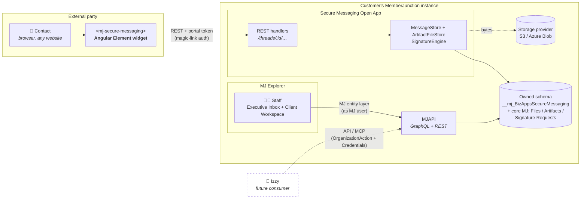
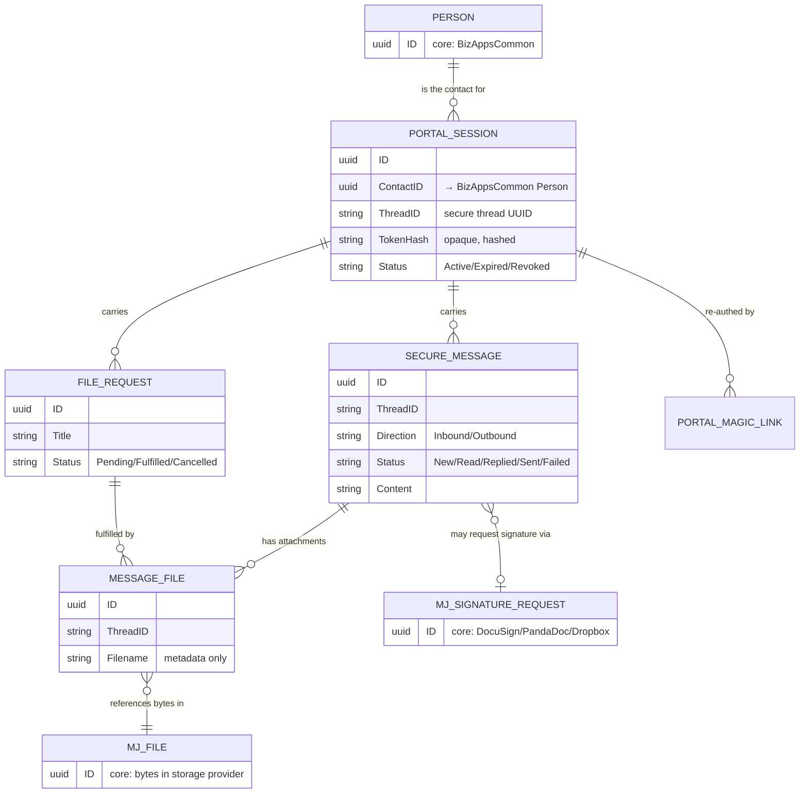
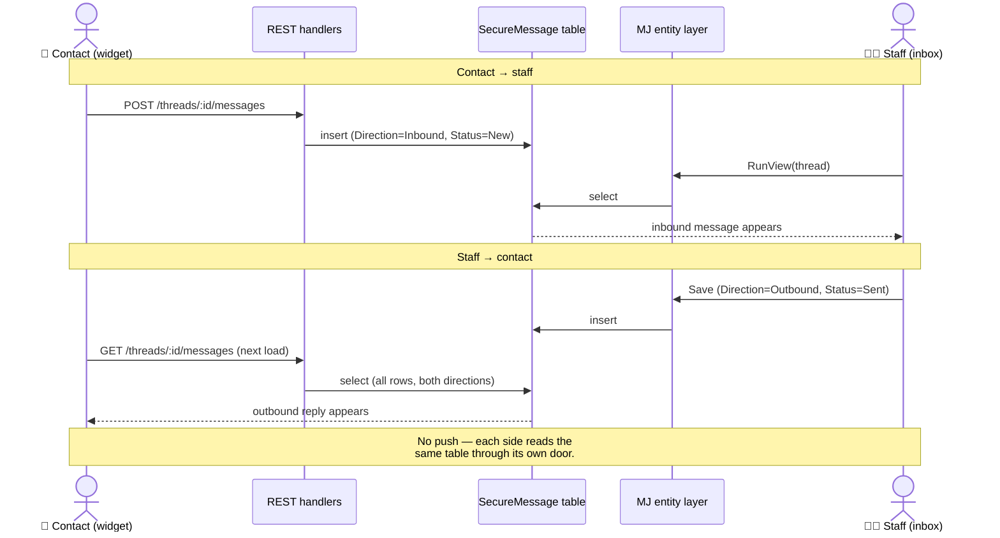
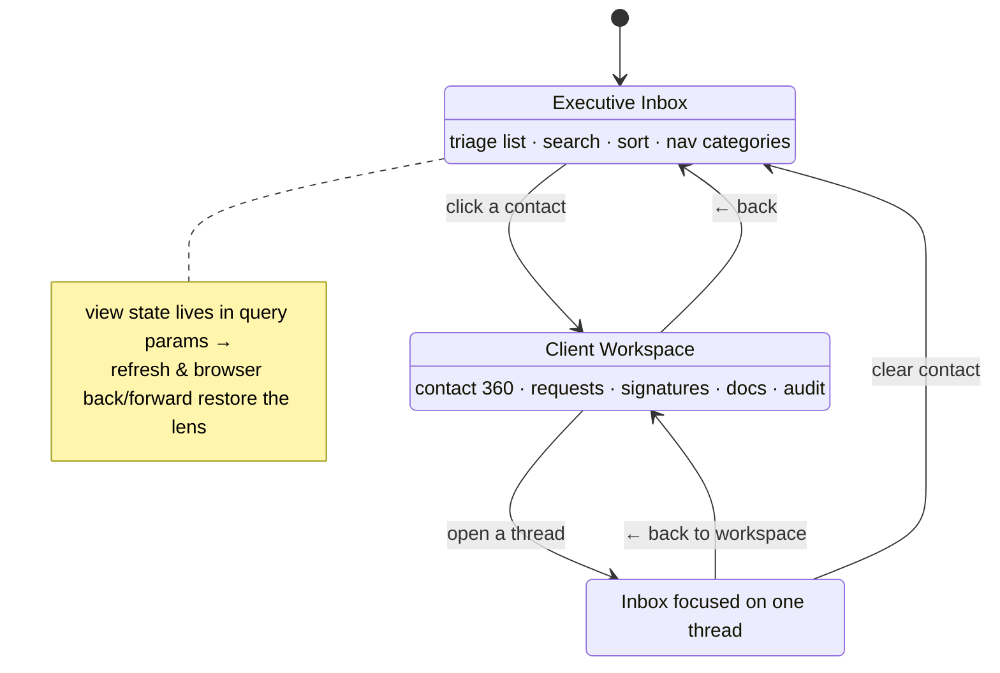
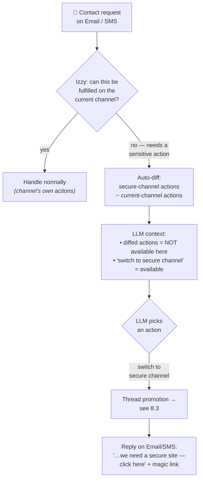
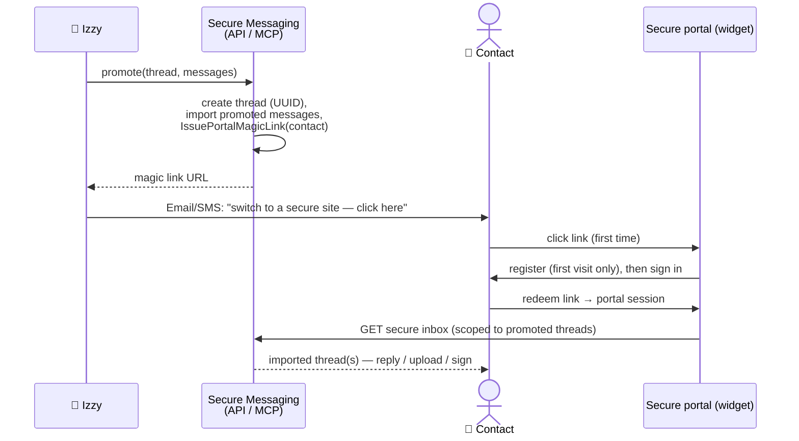
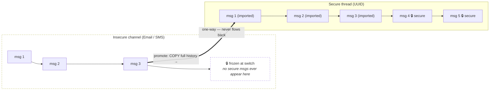

# Secure Messaging — Product Requirements Document

> Status: living document. Captures the product vision plus the verified state of the
> codebase as of this writing, so we stop rediscovering the design piecemeal.
> Sibling reference: `plans/` (the conformance-refactor plan, now complete).
>
> **Build status (latest commit `f77e33e`):** core conversation lifecycle complete &
> verified end-to-end — staff reply, compose-new-thread (the "switch to secure channel"
> flow), file requests, e-signatures, Archive, Star, Soft-delete/Trash, full thread view,
> and the full contact-widget round-trip (magic link → portal → read/send/upload). Open
> items: live contact notification (notify hook unwired — pull-only today), and the two
> **bridges** (§10) — Izzy email/SMS→secure promotion and the native-Outlook "Secure Send"
> add-in — now designed (one-way visibility rule + `PromoteThread` backbone), not yet built.
> All work is on branch `claude/amazing-volta-6L54v`.

## 1. Vision

Secure Messaging is a **free, installable MemberJunction Open App** that lets an organization
stand up a secure web portal for communicating with **external parties** (members, clients,
applicants) — exchanging messages, uploading/sharing documents, and collecting e-signatures —
without sending sensitive content over plain email.

Think **Cisco Secure Mail / TitanFile, but with a contemporary UX** and strong collaboration
features for org-to-external-party messaging (e.g. an association ↔ its members).

The canonical flow:

1. A contact emails in with something sensitive (e.g. a renewal request).
2. The org (or Izzy) replies: _"For this request we need to switch to a secure channel —
   click here to continue."_ The link is a **magic link**.
3. The contact clicks, lands on the secure portal (the **widget**), authenticates passwordlessly,
   and can now message, upload documents, and sign — all inside the secure channel.

Two halves ship together:

- **Backend services** — intentionally simple. Owned MJ entities + a small REST API that the
  widget calls. No message bus, no real-time push.
- **A drop-in Angular Element widget** (`<mj-secure-messaging>`) that anyone can embed on any
  web page (their own site, a landing page) to give external parties the contact-side experience.

## 2. Goals / Non-Goals

**Goals**

- One-command installable Open App in any MJ instance (canonical 6-package structure — **done**).
- Self-contained ("owned") data model — runs in any MJ instance with no dependency on Izzy or
  any Channel platform.
- Staff experience inside MJ Explorer: triage inbox + per-contact 360° workspace.
- Contact experience via an embeddable widget: passwordless (magic-link) access to one thread.
- File sharing and e-signature collection as first-class actions.

**Non-Goals (for v1)**

- No real-time push / websockets. The widget **pulls** (polls/loads) over REST.
- No outbound email/SMS infrastructure of our own — the magic-link _email_ is sent by whoever
  initiates (the org's existing comms, or Izzy). We provide the link + the portal.
- Izzy integration is **not** part of this app. Izzy consumes Secure Messaging later via API/MCP
  (see §8).

## 3. Actors & surfaces

| Actor                        | Surface                                                      | Auth                                                 | Reaches data via                                        |
| ---------------------------- | ------------------------------------------------------------ | ---------------------------------------------------- | ------------------------------------------------------- |
| **Staff** (org user)         | Executive Inbox + Client Workspace, **inside MJ Explorer**   | their MJ login                                       | MJ entity layer (GraphQL → DB), as the MJ user          |
| **Contact** (external party) | the `<mj-secure-messaging>` **widget**, embedded on any page | **magic link → portal session token** (passwordless) | **REST API** (`/threads/:id/...`) with the portal token |

For the workflow in Izzy, since each channel can have distinct actions, for example SMS might have diff actions than Email channels, we can have a configuration setup for Izzy where when an org turns on the Secure Message channel, they can include actions there that are NOT available in others. For example things that are more sensitive like updating someone's profile or renewing their membership. Those actions would of course be verbs in the vocabulary that are driven by the system's we are integrating with and we'll want to:
Build the library of MJ actions up so that we have more and more and more of the integrations built as standard MJ actions so we can leverage them everywhere
Then use those actions in the various channels we setup for clients in Izzy
Finally, the key piece - when someone is communicating over an insecure channel like Email or SMS, if Izzy determines their request cannot be met with insecure messaging but could be handled by the secure channel - we need to find a way to get this information to the insecure channels automatically, perhaps we "auto-diff" the actions the secure channel has with the current channel and then instruct the LLM that those actions are not available in the current context but that an action called "switch to secure channel" is available and in that case what it does is "switch" the user over to the secure channel.
The way the "switch" would work is pretty simple - the whole thread is "imported" into the secure messaging service and assigned a UUID. Then, in the email or SMS response, Izzy sends a link telling the person that their request is something we'd be pleased to assist with, but we need to switch to a secure site to ensure the information is both secure/authenticated/etc.

When the user clicks the link, they login (require a registration first time they get a link) and then they can see their secure inbox, reply, etc. They would see only the message that have been "promoted" to secure threads that have been imported there.

Both read/write the **same owned tables**, through two different doors.



## 4. Data model (owned — schema `__mj_BizAppsSecureMessaging`)

All five entities exist, are CodeGen-registered, and ship with the app:

- **Secure Messages** — one inbound or outbound message in a thread. `Direction` (Inbound/Outbound),
  `Sender`, `Recipient`, `Subject`, `Content`, `Status` (New/Read/Replied/Sent/Failed), `IsSecure`,
  `ThreadID`, `PersonID`, `PortalSessionID`, `ReceivedAt`. **App-agnostic** — does not require any
  external Channel entity.
- **Portal Sessions** — an authenticated session for one contact on one thread; opaque hashed token,
  sliding expiry, `ContactID` (a BizAppsCommon Person), `ChannelID`, `Status`.
- **Portal Magic Links** — single-use, short-lived links that redeem into a fresh Portal Session.
- **File Requests** — staff asks the contact to upload specific files; `Status` Pending/Fulfilled/Cancelled.
- **Message Files** — links an uploaded file to a thread; this table holds only references +
  display metadata. See File storage below.

### File storage (fully wired — core primitives only)

Uploaded bytes are **never** stored in our schema. The Core `ArtifactFileStore` uses
`@memberjunction/storage` `FileStorageEngine.UploadFile()` → bytes land in the org's configured
**MJ: Files** storage provider (S3 / Azure Blob / etc.), then are wrapped as **MJ: Artifacts** +
**MJ: Artifact Versions** (`ContentMode='File'`). Downloads use pre-authed `createDownloadUrl`; a
`MAX_FILE_BYTES` cap mirrors MJ's attachment pipeline. Powers attachments and File-Request fulfillment.

### E-signatures (fully wired — core engine + all providers)

Reuses the **core** `MJ: Signature Requests` entity (not a bespoke table) driven by
`@memberjunction/esignature` `SignatureEngine.SendForSignature()` (atomic create+send). All three
providers ship as deps — **DocuSign, PandaDoc, Dropbox Sign** — selected per send via an
`MJ: Signature Account` (provider + credentials). A webhook route receives provider status callbacks;
the REST surface exposes refresh-status, void, and signed-document download.



> Owned entities (schema `__mj_BizAppsSecureMessaging`) in solid boxes; `MJ_FILE`,
> `MJ_SIGNATURE_REQUEST`, and `PERSON` are **core/BizAppsCommon** entities reused, not redefined.

## 5. Backend / REST contract (the widget's API — all implemented)

Served by the Server package's Express routes, portal-token authenticated:

- `POST /auth/validate`, `POST /auth/magic-link`, `POST /auth/magic-link/redeem`
- `GET|POST /threads/:threadId/messages`
- `GET|POST /threads/:threadId/attachments`, `GET …/attachments/:id/download`
- `GET|POST /threads/:threadId/file-requests`, `POST …/:id/fulfill`
- `GET|POST /threads/:threadId/signature-requests`, `POST …/:id/refresh-status`,
  `POST …/:id/void`, `GET …/:id/signed-document`

A **MessageStore** abstraction in Core keeps the app owned-by-default:
`OwnedMessageStore` (the default; `__mj_BizAppsSecureMessaging` only) and an optional
`ChannelMessageStore` adapter (Izzy's Channel Messages + AI pipeline) selected by
`SECURE_MESSAGING_MESSAGE_BACKEND=channel`.

### Delivery model (decided)

There is **no push**. A message is "delivered" the moment its row exists in the `SecureMessage`
table for that thread:

- **Contact → staff:** the widget `POST`s an `Inbound` message via REST → `OwnedMessageStore.createMessage`.
- **Staff → contact:** staff writes an `Outbound` message (via the MJ entity layer from the inbox).
  The contact's widget shows it on its next `GET /threads/:id/messages` (which returns all rows in
  the thread, both directions).

One row, one table, two readers. This is the "very simple backend" the concept calls for.



## 6. Staff experience (MJ Explorer) — current state

Two-lens coordinator (`SecureMessagingResource`) that round-trips view state through query params
(deep-link / back-forward safe):




- **Executive Inbox** — triage list with search, sort (Date/Sender/Status), left-nav categories
  (Inbox/Starred/Sent · Escalated/Documents/Archived/Trash), per-contact Workspaces grouping,
  and a reading pane that shows the **full thread as a conversation**. Header shows the
  **signed-in MJ user** (name/email/avatar from the user record).
- **Client Workspace** — per-contact 360°: conversations, requests & signatures, documents,
  session & security, compliance badges, audit trail; basic/advanced progressive disclosure; a
  back button returns to the inbox.

**Implemented & verified end-to-end:**
- Read / triage, nav filters + live counts, read-state persistence
- **Full thread conversation view** in the reading pane (inbound left / outbound right)
- **Reply** (`Send Secure Message` action → outbound row → contact's widget sees it)
- **Compose new thread** (`Start Secure Thread` action → Person find-or-create + thread +
  session + magic link + first message → copyable link; the "switch to secure channel" flow)
- **Request Files**, **Send for Signature**, file download, session revoke
- **Archive / Unarchive** (per-thread, `PortalSession.IsArchived`, Archived category)
- **Star** (per-message, `SecureMessage.IsStarred`, persists across reload, Starred category)
- **Soft-delete / Restore** (per-thread, `PortalSession.IsDeleted`, Trash category; records
  never hard-deleted — compliance)
- Contact 360 data loading; real-user header/avatar; dark-theme design tokens throughout

**Not implemented (deliberately deferred):**
- `onForward` — removed (no clear secure-messaging meaning)
- Drafts / Notifications categories — removed (no backing data source yet)
- A live **notify** to the contact on a new message — the notify hook fires (§5) but no
  notifier is wired; delivery stays pull-only until a host registers one. See §9.

## 7. Contact experience (the widget)

`<mj-secure-messaging>` — a standalone Angular Element bundle (separate `Element` package) that
embeds the conversation UI on any external page. Authenticates via magic-link → portal session
token, scoped to a single thread. Lets the contact read/send messages, upload documents, fulfill
file requests, and complete signature requests. Talks only to the REST API (never the MJ runtime),
so it has no MJ/Explorer dependency. Brand-color / `@Input`/`@Output` configurable by the host page.

## 8. Izzy integration (future — out of scope for _this app's_ v1)

Once Secure Messaging installs cleanly in any MJ instance, Izzy supports it **externally** — via an
**API or MCP server exposed from the customer's own MJ instance**, wired as an **OrganizationAction**
with **Credentials**. None of the below lives in the Secure Messaging app; it is Izzy-side behavior
that _consumes_ this app's surface. It is recorded here because it shapes what the app must expose.

> The Izzy email/SMS → secure **promotion** flow (action-diff + thread import) is one of the two
> **bridges** detailed in §10, alongside the native-Outlook "Secure Send" bridge. §10 pins down the
> **one-way visibility rule** (full history imports into secure; secure never flows back to the
> insecure channel) and the shared `PromoteThread` backbone both bridges share. Read §10 with §8.2–8.3.

### 8.1 Per-channel action vocabularies

In Izzy, **each channel has its own set of available actions** — SMS may differ from Email, and the
**Secure Message channel can include actions that are NOT available in any insecure channel**:
sensitive verbs like _update a profile_ or _renew a membership_. Those verbs are driven by the
systems being integrated, surfaced as **standard MJ Actions**. Direction:

- **Grow the MJ Action library** — build more and more third-party integrations as standard MJ
  Actions, so the same verbs are reusable everywhere (Izzy channels, workflows, agents).
- **Compose channels from those actions** — when an org turns on the Secure Message channel in Izzy,
  they attach the (more sensitive) actions that should only be available in the authenticated,
  secure context.

### 8.2 Action-diff → "switch to secure channel" (the key piece)

When a contact is on an **insecure** channel (Email/SMS) and Izzy determines their request **can't be
fulfilled there but could be in the secure channel**, Izzy should steer them over automatically:

1. **Auto-diff** the action set of the secure channel against the current (insecure) channel.
2. Instruct the LLM that those diffed actions are **not available in the current context**, but a
   single action — **"switch to secure channel"** — _is_ available.
3. When the LLM invokes "switch to secure channel", Izzy performs a **thread promotion** (§8.3).



### 8.3 Thread promotion ("switch")

The switch is deliberately simple:

1. The entire current thread is **imported into Secure Messaging** and assigned a **UUID** (a secure
   ThreadID). Only the messages that were **promoted** become visible in the secure thread.
2. Izzy's Email/SMS reply tells the contact their request is something the org would be pleased to
   help with, but it requires switching to a secure, authenticated site — with a **magic link**.
3. On first click, the contact **registers** (first-time), then logs in and sees their **secure
   inbox** — only the promoted/imported threads — where they can reply, upload, sign, etc.

**Implications for _this_ app (what the surface must support):**

- An **import/promote** entry point: create a thread (UUID) + seed it with imported messages, then
  issue a magic link for the target contact. (Today: thread creation + `IssuePortalMagicLink` exist;
  a bulk "import these messages into a new secure thread" operation is the new capability.)
- **Contact registration on first magic-link redemption** (not just session mint) — see §9.
- The contact's secure inbox is **scoped to promoted threads** they're a party to.



## 9. Product decisions

**Resolved & built:**
1. ✅ **Starting a new thread vs. replying.** Reply appends to the existing thread (`Send Secure
   Message` action). Compose-new mints Person + ThreadID + PortalSession + magic link + first
   message (`Start Secure Thread` action).
2. ✅ **Outbound `Sender` identity** — the individual signed-in staff user's email.
3. ✅ **Star** — per-message `SecureMessage.IsStarred` (additive migration); persists.
4. ✅ **Archive** — per-thread `PortalSession.IsArchived`; hidden from inbox, Archived category.
5. ✅ **Delete** — per-thread soft-delete `PortalSession.IsDeleted`; Trash category + Restore;
   records never hard-deleted (compliance).

**Still open:**
6. **Contact notification on a new message.** Currently **pull-only** (contact sees it next visit).
   The notify hook (`setMessageNotifier` / `notifyMessage`, §5) fires on every message but **no
   notifier is wired** — and this app has no mailer. **Decided:** for the bridge flows (§10), the
   nudge is a plain **notification email with a magic link** — the universal incumbent pattern (Cisco
   /TitanFile/Virtru all do exactly this). Sent by whoever initiates (org comms / a host-registered
   notifier / Izzy); we provide the link + portal, not the mailer. Same nudge surfaces a staff member's
   new secure reply back in their native Outlook/Gmail inbox (§10.2).
7. **Contact registration on first magic-link redemption** (for the §8.3 / §10.1 switch flow). Today a
   link mints a session directly; the promotion flow wants a first-time **registration** step (create
   uid/pwd). Define what it collects/verifies. (Izzy-driven; not blocking the standalone app.) See §10.1.
8. **Thread import/promote operation** (§8.3 / §10.1) — bulk "import these messages into a new secure
   thread and scope a contact's inbox to promoted threads." `Start Secure Thread` already covers the
   create-thread-from-scratch case; promotion adds *importing existing messages* with a **one-way
   visibility rule** (§10.1). Define what's copied vs. referenced and who may invoke. This is the
   shared backbone both bridges in §10 depend on.

## 10. Bridges to existing channels

Two bridges connect Secure Messaging to where conversations *already happen* — Izzy's
email/SMS channels, and staff members' native Outlook/Gmail clients. Both reduce to the same
backbone: **promote/import an existing thread into a secure thread, then issue a magic link.**
They differ only in *where the bridge UI lives* (Izzy's LLM vs. an Outlook add-in).

### Research: how the incumbents do it (Cisco Secure Email, TitanFile, Virtru, MS Purview)

The market is strikingly consistent:

- **Send side — they keep the staff sender inside Outlook/Gmail.** Every product adds an
  **Encrypt / "Secure Send" button** to the compose window via a client add-in. Cisco: an *Encrypt*
  button in the Outlook ribbon (or the ⋯ menu in Outlook Web). TitanFile: a button literally named
  *Secure Send*. Virtru / Purview: an *Encrypt* toggle in the compose ribbon. The staff member
  composes normally and clicks one button.
- **Receive side — the external recipient always goes to a portal.** The recipient gets a plain
  **notification email** ("you have a secure message"), clicks through to a **web portal**, and on
  first visit **registers a free account / sets a passcode**. *Nobody* delivers decrypted secure
  content into an arbitrary outside inbox — that's the insecure leg they exist to avoid. **This is
  exactly our magic-link → portal → first-time-register flow.**
- **The staff member's own received replies** live in the vendor's portal, with a notification email
  landing in Outlook. True "secure replies appear as a native Outlook folder" is rare even among the
  leaders.

> Sources: [Cisco Secure Email Encryption Add-in](https://docs.ces.cisco.com/docs/cisco-secure-email-encryption-add-in) ·
> [Cisco recipient guide](https://www.cisco.com/c/en/us/td/docs/security/email_encryption/CRES/recipient_guide/b_Recipient/b_Recipient_chapter_011.html) ·
> [TitanFile Secure Send](https://www.titanfile.com/features/secure-send/) ·
> [Virtru Outlook encryption](https://www.virtru.com/blog/email-encryption/outlook) ·
> [Microsoft Purview Message Encryption](https://learn.microsoft.com/en-us/purview/manage-office-365-message-encryption)

**Conclusion:** our portal + magic-link + first-time-register *is* the recipient half of both
bridges — already built. The only genuinely new surfaces are (a) the **promote/import** backbone
operation and (b) a thin **Outlook add-in** holding the "Secure Send" button.

### 10.1 Bridge to Izzy convos (email/SMS → secure) — the promotion bridge

A regular Email/SMS thread is running with Izzy. The human or Izzy decides it needs to go secure
(§8.2 action-diff). On the switch, the thread is **promoted/imported** into a secure thread.

**The one-way visibility rule (decided):**

- The contact, after authenticating, sees the **full prior conversation history** — the
  pre-switch email/SMS messages are **copied into** the secure thread, so the secure side is the
  complete record.
- After the switch, **secure messages are never back-published to the insecure side.** The
  email/SMS thread is frozen at the switch point. Sensitive content lives **only** in the
  authenticated channel. This is both the security guarantee and the compliance boundary.



**First-click registration:** the magic link a never-seen contact receives lets them **create a
uid/pwd on first visit**, then drops them into their secure inbox scoped to promoted threads
(§9 item 7). Returning contacts just sign in.

**App-side capability needed (the backbone):** an **import/promote** operation —
`PromoteThread({ messages[], contact, channelRef })` → mint a secure ThreadID, write the imported
messages (`IsSecure=true`, flagged as imported with a `SourceChannel` reference so we know they
predate the switch), create the PortalSession, issue the magic link. `Start Secure Thread` already
covers *empty* new threads; promotion adds the **bulk message import** + the **imported-vs-native**
provenance flag. Invocable by Izzy (API/MCP) and by the Outlook add-in (§10.2).

### 10.2 Bridge to native email (Outlook "Secure Send") — staff stay in their mail client

Staff live in Outlook/Gmail. The insight: those clients are secure *for viewing*; the insecurity is
**plaintext SMTP to outside domains**. So this bridge replaces the *transport to external parties*
while keeping the *staff UX native*.

**Send (build Outlook first — Office Add-in):**

1. An **Office Add-in** (Office.js, manifest-based — one codebase across Outlook desktop/web/mobile)
   adds a **"Secure Send"** button to the compose window.
2. On click, the add-in reads the draft (recipients + subject + body + attachments) and calls our
   REST API's **promote/import** endpoint (§10.1) — moving the thread into Secure Messaging and
   sending the outbound as a **secure message (magic link)**, not plaintext SMTP.
3. The add-in **cancels the native plaintext send** (`Office.context.mailbox.item` send-blocking /
   on-send event), so nothing sensitive leaves over SMTP.

**Receive (decided — portal + email nudge, matching incumbents):**

- Secure replies land in the **MJ Executive Inbox** (already built). The staff member gets a plain
  **notification email** in their native Outlook/Gmail ("new secure reply — click here") that
  deep-links them into the inbox/thread. This reuses the §5 notify hook (wire a notifier that emails
  the staff member). It's the proven incumbent pattern and requires no mailbox write-back.
- **Deferred enhancement:** syncing secure replies into a dedicated *Secure Messaging* Outlook
  folder / Gmail label via the Graph / Gmail APIs (per-user OAuth, write-back) so replies truly never
  leave the mail client. Real work; even the incumbents mostly don't do this. Recorded as future.

```mermaid
sequenceDiagram
    actor S as 👩‍💼 Staff (in Outlook)
    participant AddIn as Office Add-in<br/>("Secure Send" button)
    participant API as Secure Messaging REST
    actor C as 👤 Contact
    participant P as Secure portal (widget)

    S->>AddIn: compose draft, click "Secure Send"
    AddIn->>AddIn: block native plaintext send
    AddIn->>API: promote(draft → secure thread) + magic link
    API-->>S: (later) reply arrives → notify email in Outlook inbox
    API->>C: notification email: "secure message — click here"
    C->>P: click → register (1st time) → read / reply
    Note over S,P: Staff stays native to SEND + get nudged;<br/>contact uses the portal. No plaintext SMTP to outside domains.
```

**Architecture note:** the add-in is a **thin client** — it holds *no* business logic, just the
button + the REST call to the promote/import endpoint. It ships as its **own downstream package**
(like the Element widget is separate), not inside the core 6 packages. Gmail (Workspace Add-on,
CardService) is the symmetric second target once Outlook proves the pattern.

### 10.3 The `PromoteThread` backbone (built)

The shared promote/import backbone is implemented across all four layers:

- **Migration** — `SecureMessage.IsImported` (BIT) + `SourceChannel` (NVARCHAR) provenance columns.
- **Core** — `PortalAuthService.promoteThread()` provisions the contact + secure thread + session +
  magic link (reusing `startSecureThread`); `MessageStore.importMessages()` bulk-copies the prior
  messages (typed in `OwnedMessageStore`: `IsImported=true`, `SourceChannel`, preserved
  direction/sender/timestamp, `Status='Read'`, **no notifier** — historical copies).
- **Action** — `Promote Thread` (`__PromoteThread`), the GraphQL `RunAction` surface for Izzy/MCP
  (PRD §8 OrganizationAction). Takes `ContactEmail`, `SourceChannel`, `MessagesJSON`, `ContactName?`;
  returns `ThreadID`, `MagicLinkToken`, `ImportedCount`.
- **REST** — `POST /secure-messaging/api/v1/promote` for the server-to-server callers (Izzy / the
  Outlook add-in backend), authed the **MJ-Slack way**:
  - **HMAC-SHA256 signing secret** (`SECURE_MESSAGING_PROMOTE_SECRET`), verified over
    `v0:${timestamp}:${rawBody}` in `x-sm-signature` with a 5-minute replay window + timing-safe
    compare — mirroring MJ's `verifySlackSignature`. Empty secret ⇒ route returns **503** (no
    insecure default). It sits on the **public** side of the router (before the portal-token
    middleware) because promotion *creates* the contact session.
  - **Run-as identity** by `initiatedByEmail` → `UserCache` → real MJ user, falling back to the
    system user — mirroring MJ messaging-adapters' `resolveContextUser`, so imported/seed messages
    attribute to the actual staff member.

> Researched MJ Core's Slack/Teams messaging adapters
> (`packages/MessagingAdapters`) to adopt the blessed inbound-integration pattern rather than
> invent one: signature-verify → email→user resolution → do the work.

### 10.4 Remaining build order

1. ✅ **Backbone** — `PromoteThread` (Core + Action + REST) + provenance flag. **Done** (§10.3).
2. **Wire a notifier** (§9 item 6) so the email-nudge receive path works for staff and contacts.
3. **First-click contact registration** (§9 item 7) on magic-link redemption.
4. **Outlook Office Add-in** (separate package) — the "Secure Send" button → promote endpoint +
   block-native-send.
5. **Later:** Gmail Add-on; native-mailbox folder/label write-back sync.

## 11. Engineering standards (established this session)

- Canonical MJ Open-App structure; `@memberjunction/*` as caret peer deps, internal `@mj-biz-apps/*`
  pinned; `ngc` for the Angular lib (Ivy), separate Element app for the widget bundle.
- **CodeGen owns entity metadata**; sync is an update-only override layer (no hand-authored entities).
- **No weak typing** — generated entity classes + typed `.Load()`/properties, never bare `BaseEntity`
  `.Get()`/`.Set()`. Check `Save()`/`Load()` booleans; use `LatestResult.CompleteMessage`.
- **All colors via `--mj-*` design tokens** (light + dark correct); no hardcoded hex.
- Current user/name/email read **synchronously** from `Metadata.Provider.CurrentUser`; avatar from the
  cached `MJ: Users` record, never blocking the header; `detectChanges()` after async loads.
